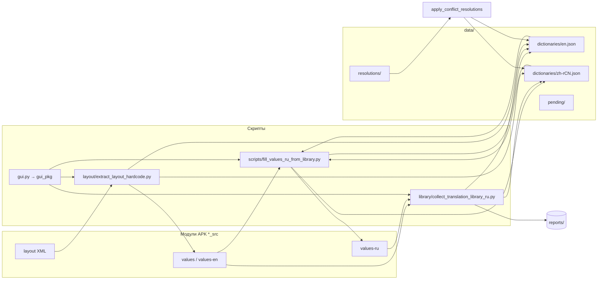

# Карта проекта automotive_translator

Документ описывает, **где что лежит**, **что делает каждый компонент** и **как связаны типичные сценарии** перевода прошивки.

## Корень репозитория

| Файл | Назначение |
|------|------------|
| `gui.py` | Единственная точка входа: запуск PyQt6 GUI |
| `README` | Краткая инструкция и примеры команд |
| `roadmap.md` | Этот файл — навигация по проекту |

Всё остальное разложено по папкам ниже.

---

## `gui_pkg/` — графический интерфейс

Десктопное приложение поверх существующих скриптов. **Не импортирует** логику fill/collect — только запускает процессы.

| Файл | Функция |
|------|---------|
| `app.py` | `main()`, инициализация `ThemeManager`, `QApplication` |
| `main_window.py` | Окно: список модулей, вкладки Обзор / Действия / Конфликты / Лог |
| `config.py` | Пути к скриптам, словарям, пресеты папок проекта, `QSettings` |
| `scanner.py` | Сканирование `*_src`, статистика строк, бейджи статуса |
| `process.py` | Очередь `QProcess`, лог stdout/stderr, прерывание |
| `workers.py` | Фоновое сканирование модуля (`QThread`) |
| `widgets.py` | Карточки статистики, строки списка модулей, виджеты конфликтов |
| `theme.py` | Светлая/тёмная тема, QSS |
| `responsive.py` | Адаптивная вёрстка: ширина сайдбара, сетки кнопок |

**Запуск:** `python3 gui.py` (нужен `pip install -r requirements/gui.txt`).

---

## `scripts/` — CLI-точки входа

Скрипты, которые удобно вызывать из терминала или из GUI.

| Файл | Функция |
|------|---------|
| `fill_values_ru_from_library.py` | **Главный пайплайн:** словарь → `res/values-ru`, режимы `--ensure-dictionary`, `--library-only`, Google Translate |
| `sort_translation_libraries.py` | Сортировка JSON-словарей: переводы A–Z, заглушки `" "` в конце |
| `run_fill_values_ru_from_library.sh` | Интерактивный fill на Linux (+ установка `deep-translator`) |
| `run_fill_values_ru_from_library.ps1` | То же для Windows |
| `run_fill_values_ru_from_library.cmd` | Обёртка для `.ps1` |

**Рабочая директория процессов:** корень репозитория (`library/paths.py` → `REPO_ROOT`).

---

## `library/` — ядро логики перевода

Переиспользуемые модули; большинство CLI-скриптов добавляют эту папку в `sys.path`.

| Файл | Функция |
|------|---------|
| `paths.py` | **Канонические пути:** словари, pending, resolutions, reports, scripts |
| `source_resolve.py` | Чтение locale-папок, приоритет `values-en`, поиск в словарях, заглушки, ссылки `@android:` |
| `library_persist.py` | Загрузка/сохранение JSON-словарей, сортировка ключей, pending |
| `collect_translation_library_ru.py` | Сбор пар исходник→русский из готовых APK в словари + отчёты missing/conflicts |
| `merge_pending_library_ru.py` | Перенос заполненных строк из `data/pending/` в основной словарь |
| `apply_translation_conflict_resolutions_ru.py` | `--init` / `--apply` для ручного выбора варианта при конфликтах |
| `audit_translation_library.py` | Эвристический аудит типичных ошибок автоперевода |
| `fix_library_date_formats.py` | Массовое исправление шаблонов дат в словарях |

---

## `data/` — данные (словари и очереди)

| Путь | Содержимое |
|------|------------|
| `data/dictionaries/translation_library_ru_en.json` | Словарь **английский → русский** |
| `data/dictionaries/translation_library_ru_zh-rCN.json` | Словарь **китайский → русский** |
| `data/pending/*_pending.json` | Очередь: исходники без перевода (для ручного заполнения) |
| `data/resolutions/translation_library_ru_resolutions.json` | Ручные решения при конфликтах (один исходник — несколько ru) |

Формат словаря: объект `string_map` — ключ = исходный текст, значение = русский перевод. Заглушка отсутствия перевода: `" "`.

---

## `layout/` — хардкод в XML-разметке

| Файл | Функция |
|------|---------|
| `extract_layout_hardcode.py` | Поиск текста в `res/layout/**/*.xml`; режимы: отчёт, `--inject-values` (в `strings.xml`), `--translate-inplace` |

После inject обычно запускают `fill --library-only`, чтобы подставить переводы в новые `@string/…`.

---

## `functions/` — голосовые команды (не strings.xml)

| Файл | Функция |
|------|---------|
| `fill_values_ru.py` | Перевод `assets/total_functions.json` |
| `translate_functions.json` | Словарь команд |
| `verify_total_functions_ru.py` | Проверка покрытия |
| `run_fill_values_ru.sh` | Обёртка запуска с установкой зависимостей |

Отдельный контур от основного fill по `res/values`.

---

## `tor/` — словарь AdsHmi TOR

| Файл | Функция |
|------|---------|
| `translate_tor_dictionary_ru.py` | Перевод TOR-словаря; чекпоинты в `checkpoints/` (gitignore) |

---

## `reports/` — сгенерированные отчёты

Создаются скриптами локально, **не коммитятся** (см. `.gitignore`).

| Примеры | Откуда |
|---------|--------|
| `translation_library_ru_*_missing.json` | `collect` |
| `translation_library_ru_*_conflicts.json` | `collect` |
| `translation_library_audit.json` | `audit` |
| `fill_values_ru_google_report.json` | fill с Google |

---

## `docs/` — справочные материалы

| Файл | Назначение |
|------|------------|
| `translation_ecosystem_map.svg` | Схема связей скриптов и словарей |

---

## `requirements/` — зависимости Python

| Файл | Пакеты |
|------|--------|
| `gui.txt` | PyQt6 — только для GUI |
| `fill-values-ru.txt` | deep-translator — для fill с Google Translate |

---

## Потоки данных (как это связано)

---

## Типичные сценарии

### 1. Новый модуль / прошивка

1. `python3 scripts/fill_values_ru_from_library.py --ensure-dictionary --root /path/Translated`
2. Правка `data/dictionaries/*.json` (убрать заглушки `" "`)
3. `python3 library/collect_translation_library_ru.py --root /path/Translated --track both`
4. `python3 scripts/fill_values_ru_from_library.py --library-only --root /path/Translated`

### 2. Только словарь, без Google

`--library-only` (+ при необходимости `--library-overwrite`).

### 3. Хардкод в layout

1. `python3 layout/extract_layout_hardcode.py --root … --inject-values`
2. `python3 scripts/fill_values_ru_from_library.py --library-only -m …`

### 4. Конфликты перевода

1. Смотреть `reports/translation_library_ru_*_conflicts.json`
2. `python3 library/apply_translation_conflict_resolutions_ru.py --init --majority`
3. Править `data/resolutions/translation_library_ru_resolutions.json`
4. `--apply`, затем `collect`

### 5. Работа через GUI

`python3 gui.py` → выбрать папку `Translated` → модуль → вкладки **Обзор** (статистика, быстрые действия), **Действия** (fill, layout), **Конфликты** (выбор варианта), **Лог**.

---

## Где искать настройки путей в коде

- Все константы путей: `library/paths.py`
- GUI (пресеты прошивок, треки конфликтов): `gui_pkg/config.py`
- При добавлении нового скрипта: положить CLI в `scripts/` или тематическую папку (`layout/`, `functions/`), общую логику — в `library/`, данные — в `data/`.
